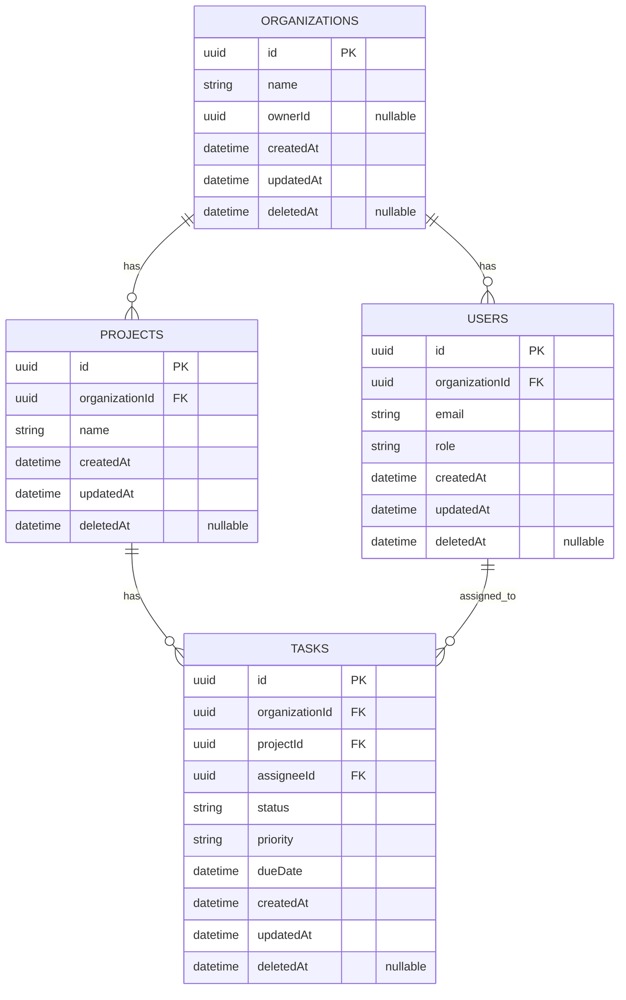

# Team Task Management API

[](https://github.com/Jhon-Mosk/nestjs-team-tasks-api/actions/workflows/ci.yml)


Production‑ready backend API для управления командами и задачами.

**Stack**: NestJS · TypeORM · PostgreSQL · Redis · BullMQ · Socket.io · Swagger · Jest · GitHub Actions

## Возможности

- **Authentication**
  - Access JWT в `Authorization: Bearer …`
  - Refresh JWT в `httpOnly` cookie `refresh_token` (server-side invalidation в Redis)
- **Multi‑tenant isolation**: все операции ограничены `organizationId` из access JWT
- **RBAC**: роли `OWNER | MANAGER | EMPLOYEE`
- **CRUD**: Organizations / Users / Projects / Tasks (soft delete, pagination)
- **Caching**: Redis cache для `GET /tasks` с TTL + инвалидацией
- **Async reports**: `POST /reports/tasks` → job в BullMQ → результат в WebSocket
- **Cron**: ежедневная маркировка просроченных задач как `overdue`
- **API hygiene**
  - строгая DTO‑валидация
  - единый формат ошибок через `HttpExceptionFilter`
  - HTTP‑логи с редактированием `Authorization` / `Cookie` / `Set‑Cookie`

## Быстрый старт (dev)

```bash
cd repo
npm ci
npm run start:dev
```

`start:dev` поднимает `postgres` + `redis` через Docker Compose (см. `package.json` scripts `docker:up:dev` / `docker:down:dev`).

## Конфигурация (.env)

Создай `.env` на основе `.env.example` (файл в `.gitignore`, не коммить).

Минимально нужны:
- **PostgreSQL**: `POSTGRES_HOST`, `POSTGRES_PORT`, `POSTGRES_USER`, `POSTGRES_PASSWORD`, `POSTGRES_DB`
- **Redis**: `REDIS_HOST`, `REDIS_PORT`, `REDIS_USER`, `REDIS_USER_PASSWORD` (+ `REDIS_PASSWORD` для контейнера)
- **JWT**: `JWT_ACCESS_SECRET`, `JWT_REFRESH_SECRET`, TTL переменные

Опционально:
- **Tasks list cache**: `TASKS_LIST_CACHE_TTL_SEC` (секунды, default `300`)

ENV валидируется при старте через Zod (`src/config/env.schema.ts`).

## Swagger (OpenAPI)

Swagger **никогда не включается в production**. В dev/test включается только если:
- `SWAGGER_ENABLED=true`
- заданы `SWAGGER_USER` и `SWAGGER_PASSWORD`

Endpoints:
- Swagger UI: `GET /docs`
- OpenAPI JSON: `GET /docs-json`

JWT в Swagger: кнопка **Authorize** → `Bearer <accessToken>`.

## Основные endpoints

- **Health**
  - `GET /health`
- **Auth**
  - `POST /auth/register` → `{ accessToken }` + refresh cookie
  - `POST /auth/login` → `{ accessToken }` + refresh cookie
  - `POST /auth/refresh` → `{ accessToken }` (refresh cookie required)
  - `POST /auth/logout` → `{ ok: true }`
  - `GET /auth/me` (JWT)
- **Organizations**
  - `GET /organizations/me` (JWT)
  - `PATCH /organizations/me` (JWT, OWNER)
- **Users** (JWT, OWNER/MANAGER)
  - `POST /users`, `GET /users`, `DELETE /users/:id`
- **Projects** (JWT, OWNER/MANAGER)
  - `POST /projects`, `GET /projects`, `GET /projects/:id`, `PATCH /projects/:id`, `DELETE /projects/:id`
- **Tasks** (JWT)
  - `POST /tasks`, `GET /tasks`, `GET /tasks/:id`, `PATCH /tasks/:id`, `DELETE /tasks/:id`
- **Reports** (JWT)
  - `POST /reports/tasks` → `{ jobId, status }` (результат приходит по WS)

## Примеры запросов (curl)

```bash
# register
curl -sS -X POST http://localhost:3000/auth/register \
  -H 'content-type: application/json' \
  -d '{"organizationName":"Acme Inc.","email":"owner@acme.test","password":"supersecretpassword"}'

# login (получить access token; refresh_token будет в cookie)
curl -i -sS -X POST http://localhost:3000/auth/login \
  -H 'content-type: application/json' \
  -d '{"email":"owner@acme.test","password":"supersecretpassword"}'
```

## WebSocket (reports delivery)

Socket.io gateway аутентифицируется access JWT в handshake и автоматически добавляет сокет в room `user:{sub}`.

События:
- `tasks-report:done`
- `tasks-report:failed`

## Errors format

Все ошибки приводятся к единому JSON‑формату:

```json
{
  "statusCode": 422,
  "message": ["field must be an email"],
  "error": "Unprocessable Entity",
  "timestamp": "2026-04-22T12:00:00.000Z",
  "path": "/auth/login"
}
```

`message` может быть строкой или массивом строк (валидация).

## Миграции (TypeORM)

DataSource: `src/database/data-source.ts`. Команды читают `.env`.

```bash
cd repo
npm run typeorm:migration:generate -- src/database/migrations/<MigrationName>
npm run typeorm:migration:run
```

## Тестирование и качество

```bash
cd repo
npm run lint
npm test
npm run test:cov
```

В CI настроен **coverage gate ≥ 70%**.

## Интеграционные тесты

Интеграционные тесты проверяют HTTP + PostgreSQL + Redis (Jest + supertest).

Подготовка:
- поднять зависимости: `docker compose up -d postgres redis`
- создать БД под интеграционные тесты (имя берётся из `test/.env.integration`):

```bash
docker compose exec postgres psql -U app -d postgres -c "CREATE DATABASE mydb_integration;"
```

Запуск:

```bash
cd repo
npm run test:integration
```

## NFR audit checklist (быстро и воспроизводимо)

Цель: за пару минут убедиться, что API “production‑ready” по нефункциональным требованиям.

### 1) Swagger gates

- При `SWAGGER_ENABLED=false` → `/docs` и `/docs-json` **не должны работать** (Swagger не регистрируется).
- При `SWAGGER_ENABLED=true` и кредах → `/docs` должен просить Basic Auth (401 + `WWW-Authenticate`).

### 2) Error codes + shape

Проверить, что коды и формат ошибок совпадают с контрактом:
- **401**: защищённый endpoint без JWT
- **403**: недостаточно прав (например employee пытается admin‑операцию)
- **404**: несуществующий ресурс
- **409**: конфликт уникальности (например duplicate project name)
- **422**: DTO validation
- **503**: зависимость недоступна (например Redis down в refresh/logout flow)

### 3) Logs redaction

Убедиться, что в логах нет:
- `Authorization: Bearer …`
- `Cookie: refresh_token=…`
- `Set-Cookie: refresh_token=…`

## ER diagram (Mermaid)



## CI

Workflow: `.github/workflows/ci.yml`.

На push/PR запускается:
- `npm ci`
- `npm run lint`
- `npm run test:cov` (coverage gate)
- `npm run build`
- `docker build`
